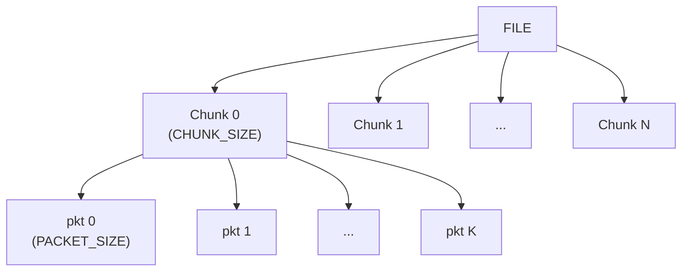
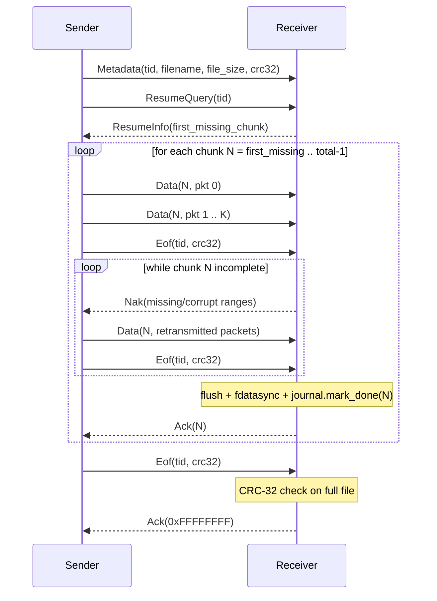

# CFDP Class 2 — Reliable File Transfer over UART

A lightweight implementation of a CFDP-inspired Class 2 (acknowledged, reliable) file transfer protocol, designed for embedded systems communicating over a serial link (UART / PTY).

The receiver is written in **C++17** and targets Linux embedded platforms. The sender is a **Python 3** script that runs on the ground station.

---

## Repository layout

```
cfdp_v2/
├── receiver/                       # All C++ sources
│   ├── Types.h                     # PDU structs and protocol constants
│   ├── Transport.h                 # ICfdpTransport abstract interface
│   ├── UartTransport.{h,cpp}       # UART / PTY framed transport
│   ├── Crc.{h,cpp}                 # CRC-8 (per packet) + CRC-32 (full file)
│   ├── PacketList.{h,cpp}          # Doubly-linked packet slots within a chunk
│   ├── PduCodec.h                  # Wire parsers for NAK / ACK PDUs
│   ├── Journal.{h,cpp}             # Crash-safe persistence of transfer state
│   ├── CfdpReceiver.{h,cpp}        # Protocol state machine
│   └── receiver_main.cpp           # Entry point → receiver_proc binary
├── sender/
│   └── sender.py                   # Python ground-station sender
├── CMakeLists.txt
└── cfdp_send.sh                    # End-to-end test script (socat PTY loopback)
```

---

## Protocol overview

The file is split into two levels of granularity:



### Chunk level — crash recovery (Journal)

Each chunk is tracked in a crash-safe **journal** written atomically to disk (`write tmp + rename`). On reboot, the receiver loads the journal and answers a `ResumeQuery` from the sender with the index of the first missing chunk. The sender resumes from that point — previously received and `fdatasync`'d chunks are never retransmitted.

### Packet level — in-flight reliability (PacketList)

Inside a chunk, a doubly-linked `PacketList` holds one slot per packet. Missing or CRC-8-failing packets are collected into contiguous `NakPdu` ranges and retransmitted until the chunk is complete. Slot insertion is O(1) via a direct index array.

---

## PDU reference

| Type | Hex | Direction | Description |
|------|-----|-----------|-------------|
| `Metadata` | 0x01 | sender → receiver | File name, size, chunk/packet sizes, CRC-32 checksum |
| `Data` | 0x02 | sender → receiver | One packet: chunk index, packet index, payload + CRC-8 |
| `Eof` | 0x03 | sender → receiver | End-of-file signal; triggers completion check |
| `Nak` | 0x04 | receiver → sender | Missing/corrupted packet ranges for one chunk |
| `Ack` | 0x05 | receiver → sender | Chunk confirmed (`chunk_index`) or transfer complete (`0xFFFFFFFF`) |
| `ResumeQuery` | 0x06 | sender → receiver | "Where are you on transaction `tid`?" |
| `ResumeInfo` | 0x07 | receiver → sender | `first_missing_chunk` (0 = start over, `0xFFFFFFFF` = all done) |

All PDUs are framed on the wire with a 4-byte little-endian length prefix.

---

## Transfer flow



---

## Robustness guarantees

| Failure scenario | Recovery |
|-----------------|----------|
| Packet lost in transit | Missing slot detected → included in NAK → retransmitted |
| Packet corrupted | CRC-8 mismatch → slot marked invalid → included in NAK |
| Receiver reboots mid-chunk | In-progress chunk discarded; sender re-sends it from packet 0 |
| Receiver reboots between chunks | Journal loaded on boot; `ResumeInfo` points sender to first missing chunk |
| `Ack(chunk)` lost | Sender retransmits `Eof`; receiver re-sends `Ack` on duplicate packet 0 |
| Final `Ack` lost | `ResumeInfo` returns `0xFFFFFFFF`; sender re-sends `Eof`; receiver re-sends final `Ack` |
| File fails CRC-32 | Final ACK withheld; sender must restart from scratch |
| Path traversal in filename | Rejected in `handle_metadata` (no `/` or `..` allowed) |

---

## Build

**Requirements:** CMake ≥ 3.16, C++17 compiler, zlib.

```bash
mkdir build && cd build
cmake -DCMAKE_BUILD_TYPE=Release ..
make -j$(nproc)
```

This produces `build/receiver_proc`.

**Cross-compilation for aarch64 (Yocto SDK):**
```bash
cmake -DCMAKE_TOOLCHAIN_FILE=<sdk>/environment-setup-aarch64-poky-linux \
      -DCMAKE_BUILD_TYPE=Release ..
```

---

## Running

### Loopback test (socat PTY)

`cfdp_send.sh` sets up a virtual PTY pair, launches `receiver_proc` on one side, and runs the Python sender on the other. If a receiver journal and the source file from a previous interrupted run are both present, the transfer resumes automatically.

```bash
./cfdp_send.sh
```

**Interrupt and resume:**
```bash
./cfdp_send.sh    # Ctrl-C partway through
./cfdp_send.sh    # resumes from the last completed chunk
```

### Real UART

```bash
# On the embedded target
./receiver_proc /dev/ttyUSB0 /mnt/state /mnt/recv

# On the ground station
python3 sender/sender.py /dev/ttyUSB1 /path/to/file.bin dest_name.bin
```

---

## Configuration

| Parameter | Default | Location | Description |
|-----------|---------|----------|-------------|
| `CHUNK_SIZE` | 1 MB | `Types.h` / `sender.py` | Journal granularity; larger = fewer journal writes, more re-work on reboot |
| `PACKET_SIZE` | 4 KB | `Types.h` / `sender.py` | Transport unit; must fit in UART TX buffer |
| `TIMEOUT_S` | 0.5 s | `sender.py` | Sender retransmission timeout |
| `LOSS_RATE` | 2% | `sender.py` | Simulated packet loss (test only) |
| `CORRUPT_RATE` | 1% | `sender.py` | Simulated bit corruption (test only) |
